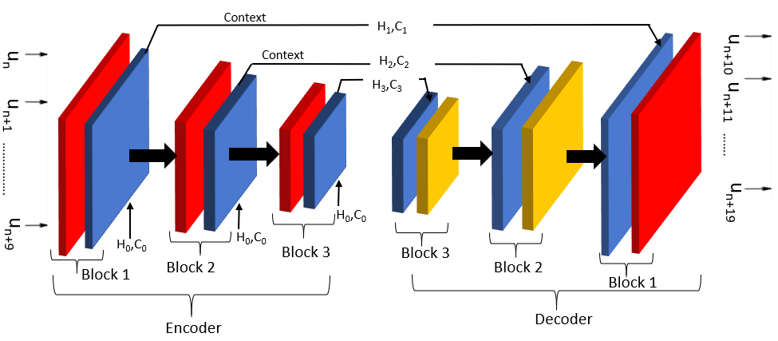
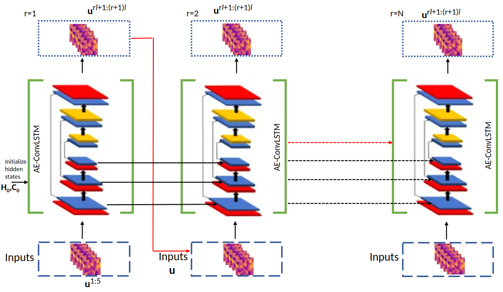

# AE-ConvLSTM_Flow_Dynamics

This repo is the work done in an attempt to learn Navier-Stokes problem using physics constraint without data. The network used was AE-ConvLSTM which is an extended version of the auto-encode convlstm network by https://github.com/jhhuang96/ConvLSTM-PyTorch. The modified network enables the learning of long chain of time steps (~100 +). The network structure looks something like this:

<figure>
  
  <figcaption>Red represents classical convolutional layer, blue represents ConvLSTM layer and yellow represents de-convolutional layer.</figcaption>
</figure>

The document explaining ConvLSTM and the training of the network along with results (Please cite :) ) : (yet to be posted).

The network is tested on data-driven cases: That is training the network using data and the testing it on unseen data. One attempt is the viscous burgers equation 
